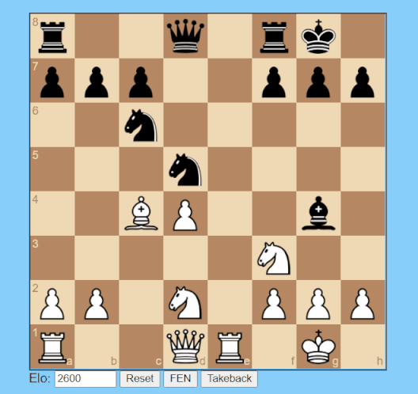

# ChessNN

ChessNN is a neural network that plays chess in a more human-like way as opposed to modern search-based chess engines


## Purpose of this project 

When I was younger, I remember playing Chess Titans——the chess game that came pre-installed with Windows 7. You could play a computer opponent on a fancy 3d chessboard. But playing against the computer wasn't nearly as fun as I had hoped. I remember the computer easily beating me on some settings and being boringly passive on others. I could never get it to be a difficult but not overwhelming opponent.

Learning about neural networks gave me the idea to make a chess engine that plays like humans: one that can make interesting, bold moves but can overlook things the same way humans do. Searching online, I found that the [maia-chess](https://github.com/CSSLab/maia-chess/tree/3d1fa7512401a6792dc7e5cd21f52c684df55cc7) project embodied the same idea. This is my first github project, so as practise, I won't use any of their code. 

## Requirements
This code was only tested and intended for **Windows** machines. 
To use this code you have to have a python distribution installed. Additionally you need:
- python-chess
- numpy
- tensorflow
- flask
- flask_cors

To can install these with:
```
pip install tensorflow numpy chess flask flask_cors
```

## How to play

You can play against the trained network through your browser. 
To do so run `python_backend.py` and click `main.html`

```
python <dir>\ChessNN\interface\python_backend.py
```
---


## How to create dataset and network

The largest source of human games is the [lichess database](https://database.lichess.org/) where one can download in excess of 3 billion standard games. 
Processing them requires the 
[`pgn-extract`](https://www.cs.kent.ac.uk/people/staff/djb/pgn-extract/) tool in the path.


### Filter pgn

You can filter your pgn files with `filter_pgn.ipynb` according to your chosen conditions (elo range, time controls). The tags I used are in `\pgn_npz_tag_files`.

### Generating tensor database

To convert pgn files to tensors use `generate.ipynb`

### Training

Initializing and training of the network is done in `training.ipynb`

